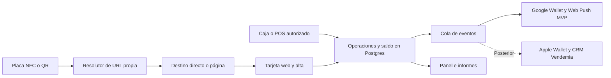

# Plan integral: plataforma NFC/QR, fidelización y recuperación de clientes

Versión 2: 1 de octubre de 2026. Incorpora decisiones del propietario: dominio vendemias.com, vendemia.lat como alternativa, Vercel + Supabase, Google Wallet obligatorio en el MVP e iPhone mediante web/PWA. Mercado inicial: Perú. Propuesta para validar con 5–10 negocios, comenzando por barberías y salones. Los tiempos, prioridades cuantitativas y presupuestos son estimaciones, no cotizaciones ni resultados medidos.

## 1. Decisión de producto

Construir una plataforma propia para múltiples comercios que conecte descubrimiento, registro, compra/visita validada, recompensa y regreso del cliente. La placa es un punto de entrada. El producto recurrente es la relación con el cliente, las acciones de recuperación y la mejora del negocio basada en datos.

Propuesta comercial sugerida: **“Ayudamos a que te encuentren, vuelvan y compren más; medimos qué funciona y te damos acciones concretas para mejorar.”**

MVP acordado: URL propia + panel de N enlaces + placas preconfigurables + tarjeta web/PWA + Google Wallet funcional + caja rápida + registro de operaciones + panel básico + consentimiento + push y recuperación medible básica. Google Wallet es requisito de salida: emitir, guardar y actualizar pases en producción. Una demo web sirve para pruebas internas, pero no cumple por sí sola este MVP. Solicitar la aprobación del emisor desde la primera semana.

Después del MVP: extracción y análisis de reseñas de Google Maps como prioridad estratégica; integración con Vendemia vendedor digital/CRM/panel como fuente complementaria; Apple Wallet y audiencias de anuncios. iPhone tiene soporte web/PWA completo desde el MVP, sin exigir Apple Wallet ni instalar la PWA para participar. Las tarjetas de fidelización no procesan pagos bancarios: registrar una compra confirmada no requiere construir una pasarela propia.

No usar el porcentaje de Android/iPhone citado en el planteamiento como dato verificado: medir dispositivos entre los clientes del piloto, especialmente en salones premium.

## 2. Hallazgos que cambian el diseño

| Tema | Decisión |
|---|---|
| Dependencia del fabricante | Grabar un dominio controlado por la plataforma; comprar chips escribibles, sin URL de proveedor bloqueada. |
| Independencia del comercio | Ofrecer exportación y, para quien lo necesite, subdominio del propio negocio configurado antes de bloquear el chip. |
| Enlace único | Redirección HTTP directa, sin página intermedia ni formulario obligatorio. |
| Captura de datos | Un toque anónimo no revela teléfono ni identidad. Capturar datos en una acción voluntaria de registro. |
| Recompensas | Nacen de operaciones verificadas, no de aperturas de URL ni de reseñas. |
| Cada compra cuenta | Evitar un máximo universal de un sello por día. Deduplificar cada transacción. |
| Cercanía | Función condicionada por sistema, permisos y dispositivo; no prometer una alerta por cada paso frente al local. |
| Retargeting | Consentimiento y separación por comercio desde el primer registro. |
| Informes | Separar compras, visitas, clics, feedback privado y reseñas públicas; no confundirlos. |

## 3. El chip, la propiedad y la activación

URL propuesta para grabar: `https://go.vendemias.com/t/<identificador-aleatorio>`. Se elige vendemias.com como dominio principal por continuidad con la marca y el sistema existente. Esta es una propuesta de rutas; no implica que el subdominio esté configurado. La URL identifica una pieza física y resuelve su destino en el servidor. Nunca contiene una contraseña, teléfono, saldo o acceso de administrador.

Arquitectura de direcciones propuesta:

| Dirección | Uso |
|---|---|
| `vendemias.com` | Sitio comercial y ecosistema existente |
| `go.vendemias.com/t/<id>` | Enlace inmutable de la placa |
| `go.vendemias.com/n/<negocio>` | Página pública de N enlaces |
| `go.vendemias.com/n/<negocio>/unirse` | Registro al programa |
| `go.vendemias.com/n/<negocio>/tarjeta` | Tarjeta autenticada y PWA del comercio |
| `fideliza.vendemias.com` | Panel del dueño y caja, con roles distintos |

Usar rutas por comercio en el MVP: no se necesita alta de DNS/certificado por cada negocio. Vercel admite dominios y subdominios personalizados; wildcard es una opción posterior si aporta valor comercial. [Dominios en Vercel](https://vercel.com/docs/domains/working-with-domains).

`vendemia.lat` queda como dominio alternativo de marca/campañas si está bajo control del propietario. Antes de fabricar, verificar titularidad, renovación y DNS de los dominios que se vayan a usar. Evitar dividir sesiones/PWA entre dos dominios o sumar un salto por usar un acortador secundario. Un cambio de slug del negocio nunca cambia el identificador grabado del dispositivo.

NTAG213 es un candidato para URLs cortas; confirmar capacidad NDEF, antena y lectura sobre el material final. Su bloqueo de escritura sirve para impedir regrabación, no para impedir copiar la URL. Las funciones de bloqueo están documentadas por [NXP](https://www.nxp.com/docs/en/data-sheet/NTAG213_215_216.pdf).

Flujo de producción y entrega:

1. Crear lote, identificador público y código secreto de activación separado.
2. Grabar una URL propia en el chip. Imprimir QR y código de soporte.
3. Probar NFC y QR en Android e iPhone, con el marco/display terminado. Usar soporte apto para metal cuando corresponda.
4. Confirmar URL y correspondencia física; aplicar bloqueo permanente y verificarlo. No bloquear antes de estas pruebas.
5. Asignar la pieza al pedido/comercio. El dueño la reclama con sesión autenticada y código de un solo uso entregado por canal privado.
6. Elegir destino y publicar. Cambiar el destino modifica el servidor, sin regrabar el chip.

No usar “el primero que escanea se vuelve dueño”. Un visitante nunca puede apropiarse de la placa. Estados: fabricada, probada, asignada, activa, suspendida y retirada. Registrar cambios, actor y fecha. Transferir propiedad requiere autorización del propietario o recuperación verificada.

Permitir configuración antes de entregar: un operador autorizado carga marca, enlaces y programa; deja una vista previa y luego invita al dueño a administrar. El cliente del negocio recibe la placa lista para usar. Registrar por separado quién configuró y quién es el propietario.

Si se quiere distinguir NFC de QR, usar dos rutas hermanas asociadas al mismo dispositivo. El parámetro de origen mide el enlace usado; no prueba presencia física ni distingue una copia compartida.

Un chip ya bloqueado con una URL de Aimentcard u otro proveedor no se libera con software propio. Exigir chip en blanco/escribible o URL propia grabada de fábrica y probada antes de la compra masiva.

Bloqueo no equivale a antifraude: se puede copiar la URL o cubrir el QR con una pegatina. Controles físicos, dominio visible y revisiones del local siguen siendo necesarios. NTAG424 DNA permite mensajes dinámicos autenticables, pero añade gestión de claves y validación; evaluarlo solo si existe fraude que lo justifique. Tampoco demuestra por sí solo una compra. [Ficha de NXP](https://www.nxp.com/docs/en/data-sheet/NT4H2421Gx.pdf).

Continuidad: dominio con renovación automática, accesos de recuperación, DNS exportable, copias del mapa dispositivo–destino y restauración ensayada. Migrar de hosting sin cambiar URLs. Un dominio propio de plataforma evita depender del fabricante, pero el comercio todavía depende de la plataforma. Contratar un periodo explícito de redirección tras la baja y ofrecer exportación; no vender “para siempre” sin financiación y continuidad definidas.

## 4. Modos de uso de cada placa

| Modo | Experiencia pública | Configuración del dueño |
|---|---|---|
| Enlace directo | Abre Google, WhatsApp, carta, reserva o web | Pegar URL, probar y publicar |
| Página de enlaces | Logo, propuesta y N enlaces publicados | Añadir, editar, activar, ocultar y reordenar; vista previa móvil |
| Fidelización | Beneficio claro, alta y tarjeta | Regla, premio, vigencia y sucursales |
| Opinión privada | Encuesta breve después de una experiencia | Preguntas y responsable de atención |
| Campaña | Oferta o reserva con atribución | Fechas, condiciones y presupuesto |

El panel admite N enlaces; no se impone un límite de cinco al producto. Mostrar tres a cinco acciones principales es una recomendación visual y se puede desplegar el resto. Fidelización, reseñas, WhatsApp, reservas y catálogo son tipos de enlace, no modos mutuamente excluyentes.

Comportamiento obligatorio según los enlaces activos y publicados de esa placa:

| Cantidad | Resultado |
|---|---|
| 0 | Impedir publicar/activar una placa nueva; si una ya activa queda sin destino, mostrar página breve de indisponibilidad sin controles de administración |
| 1 | Responder 302 al destino guardado, sin intersticial, cuenta, formulario ni pantalla de marca |
| 2 o más | Mostrar página propia con los enlaces, orden y diseño publicados |

No contar borradores, enlaces ocultos, vencidos o eliminados. La configuración se publica de forma atómica; el visitante no ve una mezcla de versiones. Pasar de uno a varios, o de varios a uno, cambia automáticamente el comportamiento del mismo chip. Evitar 301 para destinos editables. En múltiples enlaces, el resolutor puede renderizar la página directamente o resolverla internamente para evitar redirecciones innecesarias; mantener URL pública compartible y canonical coherente.

El único enlace puede ser externo o la propia tarjeta web/registro. El sistema no agrega automáticamente botones de marketing que transformen una redirección en página. Medición asíncrona para no demorar la salida. No colocar píxeles ni formularios en el modo directo que contradigan esa rapidez.

Plantilla inicial: logo, nombre, una frase y botones grandes; destacar una acción primaria elegida por el dueño. Textos sugeridos: “Mi tarjeta y beneficios”, “Reservar por WhatsApp”, “Cómo llegar”, “Dejar una reseña”. Cada placa puede usar un perfil de enlaces del comercio: recepción prioriza reserva, caja fidelización, mesa carta. Duplicar plantilla y editar, sin reconstruir cada página.

Validar protocolos y destinos, impedir bucles y bloquear esquemas peligrosos. Proteger contra phishing y abuso del acortador. La página de enlaces usa componentes limitados y accesibles, sin constructor libre de HTML en el MVP.

## 5. Experiencia del cliente: valor antes que formulario

Flujo de primera visita:

1. Toca o escanea y ve el nombre del local y el beneficio: “Acumula tus compras para recibir X”.
2. Pulsa “Crear mi tarjeta”. Se crea una membresía provisional sin contraseña; el nombre puede ser opcional.
3. Ve su QR y progreso. El cajero puede acreditar una operación validada incluso si el cliente aún no instaló Wallet.
4. Se ofrece guardar en Wallet o recuperar la tarjeta mediante teléfono/correo. Verificar el contacto antes de vincular una cuenta existente o exponer su historial.
5. Se ofrece permiso comercial separado, opcional y sin casillas premarcadas.

La membresía provisional reduce filas pero puede perderse si se borra la sesión. Mostrar “Guarda tu tarjeta para recuperarla”. No asociar automáticamente personas solo porque escriban el mismo teléfono. Las fusiones requieren verificar identidad y conservar trazabilidad de movimientos.

Si el comercio prefiere registro identificado desde el comienzo: un solo campo de contacto, autocompletado y OTP; medir el tiempo real del proveedor. No prometer alta en cinco segundos con entrega de SMS externa. El cliente recurrente abre su pase/QR y no repite registro.

El QR identifica la membresía ante una caja autenticada: no debe dar acceso al teléfono, exportación de datos ni permisos para modificar puntos. Para premios de mayor valor, confirmar posesión de la cuenta mediante reto/OTP. La tarjeta web puede mostrar un QR de corta duración; no hacer depender el MVP de que todos los Wallet roten QR con el mismo mecanismo.

Guardar un pase requiere acción del usuario. Emitirlo o mostrar el botón no prueba que fue guardado. Registrar estos estados por separado y confirmar instalación solo donde la integración entregue señal suficiente.

## 6. Caja: capturar una vez y reutilizar

Pantalla principal: cámara abierta, último resultado y dos acciones grandes: **Registrar compra/visita** y **Canjear**. Sesión de empleado por turno, permisos limitados y bloqueo por inactividad. Cada empleado tiene identidad propia; un PIN compartido de cuatro dígitos no es la identidad del equipo.

Flujo manual: escanear → ver membresía y beneficio → introducir importe/referencia si aplica → confirmar → recibir resultado del servidor. Para visitas, validar asistencia; una reserva creada o cancelada no cuenta. Si el negocio tiene POS/agenda, el sistema fuente envía la operación completada y el cajero no vuelve a teclearla.

Reglas iniciales seleccionables por plantilla:

| Regla | Cuándo usarla | Control |
|---|---|---|
| Sellos por compra elegible | Consumos de valor parecido | Una acreditación por transacción, compra mínima opcional |
| Puntos por gasto | Tickets variables | Importe neto elegible en céntimos, fórmula y redondeo explícitos |
| Visitas completadas | Servicios recurrentes | Una acreditación por cita/asistencia identificada |

Capturar todas las operaciones aunque no todas generen recompensa. Si un comercio decide limitar premios por día, el historial y las métricas conservan las otras compras. Explicar la regla al cliente antes de participar.

Antifraude obligatorio: empleado autenticado, referencia de operación única, idempotencia en reintentos, autorización por sucursal y registro de correcciones. El QR dinámico de una tablet reduce reutilización, pero puede retransmitirse en vivo: no reemplaza comprobación de compra. Geolocalización del navegador tampoco la prueba.

Canje: comprobar saldo y vigencia en servidor, reservar/consumir una vez dentro de una transacción y registrar quién entregó el premio. Las devoluciones generan un movimiento compensatorio. Definir qué pasa si el premio ya se gastó; una deuda o revisión debe ser explícita, nunca una edición invisible del historial.

Si no hay conexión, mostrar pendiente y permitir guardar una operación para revisión con identificador estable; no confirmar saldo ni premios hasta sincronizar. Mantener los canjes en línea durante el piloto.

## 7. Wallet y alternativas al pago inicial de Apple

| Opción | Ventaja | Coste/dependencia y límite |
|---|---|---|
| Tarjeta web adaptable a móvil | Atiende Android/iPhone desde el día uno | Hosting; abrir enlace no instala una app |
| PWA con Web Push | Avisos propios y acceso desde inicio | En iPhone requiere instalación en inicio, versión compatible y permiso |
| Google Wallet directo | Pase persistente con marca y progreso | Emisor, revisión, integración y operación propia |
| Apple Wallet directo | Pase nativo y actualizable | Programa Developer y certificados propios |
| Proveedor de pases | Acelera emisión y mantenimiento | Suscripción/uso, dependencia y condiciones de migración |

WebKit confirma Web Push para aplicaciones web añadidas a inicio desde iOS/iPadOS 16.4, con permiso solicitado tras una interacción. No exige membresía Apple Developer. Es la alternativa concreta para postergar esa cuota, aunque instalar la PWA tiene más pasos que abrir un enlace. [Documentación de WebKit](https://webkit.org/blog/13878/web-push-for-web-apps-on-ios-and-ipados/).

Apple publica una membresía de USD 99 anuales, sujeta a precio regional. Los pases se distribuyen por web y requieren firma con certificado Apple; no hace falta una app propia en App Store para repartirlos. [Membresía](https://developer.apple.com/help/account/membership/program-enrollment), [pases](https://developer.apple.com/wallet/get-started/).

No asumir que contratar un SaaS elimina esa cuota: PassKit declara que exige certificado del cliente para pases comerciales y que Apple Developer se paga por separado. Su alternativa sirve para ahorrar desarrollo, no como opción gratuita permanente. [Condiciones y precios de PassKit](https://help.passkit.com/en/articles/3133669-the-passkit-pricing-model).

Recomendación: tarjeta web como base permanente y adaptadores directos de Wallet. Evitar comprar una dependencia mensual solo para ahorrar USD 99/año. Si la fecha de salida exige SaaS, usar siempre URL propia y verificar exportación, propiedad de certificados/identificadores y necesidad de reinstalación al migrar.

Alcance cerrado de Wallet para el MVP: una clase por programa cuando corresponda, un objeto por membresía, marca del local, progreso/saldo, premio y QR; botón de guardado, actualización tras compra/canje y recuperación ante error de proveedor. Prueba con cuentas de clientes fuera del equipo y aprobación de publicación. Apple Wallet se mantiene como adaptador posterior; no es condición del MVP.

PWA por comercio bajo una ruta estable del mismo origen público: manifest con identidad, nombre e iconos del negocio, alcance del service worker acotado y acceso autenticado a la tarjeta. No registrar un worker global que cachee redirecciones, caja o paneles. En MVP cachear recursos estáticos; saldos personales consultados en línea y nunca presentados como vigentes si no se pudieron comprobar. Suscripciones push asociadas a membresía, comercio e instalación, con baja independiente por comercio. Si el navegador instalado no conserva la sesión, recuperación verificada; no asumir continuidad de cookies entre todos los contextos de iPhone.

Google admite plataformas agregadoras con clases para distintos comerciantes. Modelar clase por programa/marca cuando corresponda y objeto por membresía; no mezclar clientes de comercios. Autorizar marcas y describir el modelo de plataforma durante la solicitud. Existe modo de prueba; la emisión pública requiere aprobación. [Modelo de agregadores](https://developers.google.com/wallet/smart-tap/introduction/collection-identifiers), [publicación](https://developers.google.com/wallet/retail/loyalty-cards/test-and-go-live/request-publishing-access).

Apple: prever organización emisora, identificadores y certificados de pase por programa según el diseño, número de serie por membresía y permisos de marca. No pedir a cada dueño que configure claves técnicas. El backend firma y sirve los pases; registrar renovaciones y expiraciones. La sincronización requiere servicio web y registro de dispositivos. [Actualización de pases](https://developer.apple.com/documentation/walletpasses/adding-a-web-service-to-update-passes).

NFC de la placa y NFC de Wallet son integraciones diferentes. El MVP lee una URL del tag y escanea QR del pase. Google Smart Tap exige terminal compatible; no convertirlo en requisito de la marcha blanca. [Requisitos de Smart Tap](https://developers.google.com/wallet/retail/loyalty-cards/resources/faq).

## 8. Notificaciones y cercanía sin promesas falsas

Google documenta mensajes `TEXT_AND_NOTIFY`, avisos por campos admitidos y límites de hasta tres mensajes notificables por pase en 24 horas. Para cercanía, admite hasta diez ubicaciones por clase y diez por objeto, con permisos de notificación y ubicación precisa permanente; Google decide distancia, permanencia y texto. [Guía específica](https://developers.google.com/wallet/retail/loyalty-cards/use-cases/trigger-push-notifications).

Hay inconsistencias entre esa guía y frases de la FAQ general sobre push. Usar la guía específica para el diseño y validar en dispositivos reales antes de vender la función como activa. La prueba debe registrar versiones y permisos.

En Apple, configurar relevancia por ubicación permite al sistema sugerir el pase en pantalla bloqueada. No equivale a garantizar una notificación publicitaria cuando alguien cruza una calle. [Relevancia de pases](https://developer.apple.com/documentation/walletpasses/showing-a-pass-on-the-lock-screen).

La PWA no será un sistema fiable de geovallas en segundo plano. Ni Wallet debe tratarse como un proveedor de eventos de ubicación individual para el CRM. Una alerta de cercanía no se convierte en “visita confirmada”.

Motor propio de comunicaciones: una misma intención elige un canal permitido; no dispara Wallet, push, WhatsApp y correo al mismo tiempo. Priorizar recompensa disponible y comunicaciones útiles. Propuesta inicial: máximo una campaña promocional semanal por comercio, horario 09:00–20:00 del cliente y pausa después de compra o reserva. Es una regla de producto, distinta de los límites de proveedores.

Automatizaciones iniciales: bienvenida voluntaria, premio disponible, recordatorio próximo al ciclo de regreso del rubro y recuperación de inactivos. “Inactivo” debe depender del ciclo del servicio: treinta días no significa lo mismo en café que en barbería.

MVP de recuperación: una plantilla para premio disponible y otra para regreso esperado; el dueño configura beneficio, periodo y activa la regla. Usar Web Push o Google Wallet según disponibilidad, consentimiento y límites. No construir todavía un editor libre de automatizaciones. Pedir instalación/notificaciones después de mostrar la tarjeta y su utilidad; rechazar el permiso no impide acumular o canjear.

Medición: `campaign_id` → elegibles → intentos → aceptados por proveedor → clic observado → compra posterior validada. Aceptación del proveedor no equivale a entrega, visualización ni lectura. Mostrar “no disponible” cuando un canal no proporcione esas señales. Enlaces de campaña propios y eventos sin datos personales en URL; si la persona abre desde otro equipo sin identificarse, no atribuir identidad por adivinación. Ventana de atribución explícita, por ejemplo siete días como hipótesis inicial, y grupo de control cuando haya volumen.

Aquí retargeting del MVP significa reactivación por canales propios con permiso. Las audiencias de Meta/Google Ads son otro módulo, posterior, con integración y medición propias. La PWA no identifica por sí sola a todo visitante ni garantiza seguimiento entre aplicaciones.

## 9. Configuración del comercio y permisos

Asistente de seis pasos: negocio/sucursal → objetivo → plantilla → beneficio/reglas → conectar canales disponibles → probar y publicar. Logo y colores se aplican automáticamente a página y pases. Al cambiar la regla, crear una versión con fecha de vigencia y respetar compromisos previos.

Meta de usabilidad: configuración básica en 5–10 minutos si el dueño ya tiene logo, URL y regla. No incluye fabricación, aprobaciones externas ni conectar cuentas sin accesos.

Panel MVP con cinco entradas: Inicio, Placas y enlaces, Clientes, Fidelización y Campañas. Configuración de negocio y equipo en menú secundario. Caja como vista separada de una mano. Opiniones e Integraciones avanzadas se incorporan después. En Inicio: ventas registradas, clientes que volvieron, premios, acciones recomendadas y alertas operativas. Opciones técnicas solo para administradores.

Roles: administrador de plataforma; propietario; gerente por sucursal; cajero; analista. El cajero no exporta contactos ni ve todos los comercios. El analista accede únicamente a negocios autorizados y a la información necesaria. Soporte con acceso temporal y auditado.

## 10. Datos, consentimiento e integración con Vendemias

Se pudo leer la página pública de [Vendemias](https://vendemias.com/) en el navegador: presenta a Mia para ventas por WhatsApp, citas, seguimiento y remarketing. Eso confirma su propuesta comercial, no la disponibilidad técnica de esos módulos ni una API pública. El repositorio actual es una tienda Next.js/React/TypeScript con Supabase; no debe asumirse que es el backend de Mia.

Datos mínimos: identificador interno, comercio, membresía, fecha de alta, contacto verificado cuando se aporta y permisos. Datos derivados de operaciones: última visita, compras netas, frecuencia, gasto y progreso. Preferencias y cumpleaños sin año solo cuando aporten valor y se entreguen voluntariamente. No pedir DNI, domicilio o fecha completa de nacimiento para una tarjeta básica.

Guardar consentimiento por propósito y canal: texto/versión, negocio, fecha, fuente, estado y revocación. Distinguir servicio de fidelización, mensajes promocionales y uso para audiencias publicitarias. Aceptar fidelización no autoriza campañas entre distintos negocios. Permiso del sistema para push tampoco reemplaza la elección comercial.

Para Perú, revisar el tratamiento con la Ley 29733 y su reglamento vigente; la Ley 32323 también afecta comunicaciones comerciales. Diseñar alta voluntaria, consentimiento específico, retiro sencillo, atención de derechos, contratos de tratamiento, transferencias internacionales y retención. Validar aplicación y registro de bancos de datos con asesoría local antes de producción. [Reglamento](https://www.gob.pe/institucion/smv/normas-legales/6426760-016-2024-jus), [Ley 32323](https://spij.minjus.gob.pe/Normas/textos/090525T.pdf).

La integración con vendedor digital/CRM/panel es posterior al MVP. Desde ahora se conserva un contrato de eventos y consentimientos para conectarla sin rediseñar clientes ni operaciones. Conversaciones, motivos de no compra y seguimiento pueden complementar las reseñas, con finalidad y permisos definidos; no confundir conversaciones con opiniones públicas ni inferir satisfacción de un silencio.

Contrato propuesto para Vendemias, pendiente de contrastar con su backend:

| Dirección | Evento | Propósito |
|---|---|---|
| Fidelización → Vendemias | `member.created`, `contact.verified` | Crear/vincular contacto autorizado |
| Fidelización → Vendemias | `reward.available`, `customer.inactive` | Ofrecer beneficio o recuperación |
| Bidireccional | `consent.updated`, `customer.deleted` | Propagar permisos, bajas y eliminación |
| Vendemias/POS → Fidelización | `purchase.confirmed`, `purchase.refunded` | Acreditar/revertir una operación real |
| Vendemias/agenda → Fidelización | `visit.completed`, `booking.cancelled` | Validar asistencia y pausar acciones inapropiadas |
| Vendemias → Fidelización | `campaign.outcome` | Medir reserva/compra atribuida, si existe señal |

Ejemplo de sobre, sin datos personales y con IDs ficticios:

```json
{
  "event_id": "evt_ejemplo_001",
  "type": "purchase.confirmed",
  "schema_version": 1,
  "tenant_id": "negocio_ejemplo",
  "source": "pos",
  "occurred_at": "2026-09-30T16:00:00Z",
  "data": {
    "purchase_id": "venta_ejemplo_101",
    "member_id": "miembro_ejemplo",
    "location_id": "sucursal_ejemplo",
    "currency": "PEN",
    "amount_minor": 4500
  }
}
```

Integración asíncrona con firma HMAC sobre cuerpo y timestamp, credenciales por integración, protección contra repetición y eventos idempotentes. Validar que la credencial tiene permiso para ese comercio; no confiar en `tenant_id` del payload. Resolver eventos tardíos, reembolso antes de compra y reintentos. El estado de consentimiento actual se consulta antes de cada envío, no solo al generar el evento.

Un único sistema confirma el pago/venta. Fidelización mantiene el historial de puntos; Vendemias gestiona conversaciones y reservas según sus capacidades reales. Usar tabla de correspondencia de IDs, no acceso directo a las bases del otro sistema. Si no hay API, empezar con CSV limitado, protegido y autorizado para contactos, con proceso de bajas; no simular sincronización en tiempo real.

WhatsApp: consentimiento, plantillas aprobadas para los mensajes que las requieran y control de la ventana de atención. Presupuestar costes variables. [Política de WhatsApp Business](https://business.whatsapp.com/policy/preview?lang=es_LA).

Audiencias de anuncios y seguimiento son una segunda integración: revisión de permisos, elegibilidad de la cuenta, requisitos del proveedor y volumen suficiente. Hash de teléfono/correo no lo vuelve anónimo. No subir datos de un comercio a audiencias de otro ni usar datos sensibles de servicios médicos. Medir coincidencia/conversión sin prometer que todos los contactos podrán ser impactados.

## 11. Reseñas, SEO y análisis de atención

La invitación a Google debe ser neutral, sin premio por publicar y sin filtrar según satisfacción. El feedback privado y la opción pública deben estar disponibles de forma consistente; nunca mostrar Google solo a quienes dan cinco estrellas. No pedir que la reseña incluya el nombre de un empleado ni fijar cuotas de reseñas para el personal. [Política de Google Maps](https://support.google.com/contributionpolicy/answer/7400114).

Un clic en “Opinar en Google” se registra como clic, no como reseña publicada. Una reseña pública no puede vincularse de forma fiable a un cliente del programa solo por su nombre.

La API de Business Profile permite consultar reseñas de ubicaciones autorizadas, con acceso al proyecto y OAuth. Su aprobación no es la aprobación de Google Wallet. [Acceso y OAuth](https://developers.google.com/my-business/content/basic-setup), [reseñas](https://developers.google.com/my-business/content/review-data).

Existe una condición material para el análisis automático: la política de Business Profile restringe almacenamiento de contenido, establece un máximo de treinta días para el almacenamiento permitido y prohíbe manipular/agregar ese contenido almacenado. No diseñar un almacén histórico o análisis por IA suponiendo que todo dato accesible por API es reutilizable. Confirmar expresamente el uso permitido para informes y terceros antes de automatizarlo. [Política de la API](https://developers.google.com/my-business/content/policies).

La obtención de reseñas reales de Google Maps es un requisito estratégico de la fase posterior, no se sustituye por una encuesta propia. Preparar durante el MVP la ficha de ubicación y solicitud de acceso; construir el conector y el análisis en la primera fase posterior.

Comparación de vías para esa fase:

| Vía | Evaluación y decisión |
|---|---|
| Business Profile API + OAuth del comercio | Primera opción: consulta paginada de locales verificados y autorizados. Requiere aprobación de proyecto y validar derechos de procesamiento. |
| Places API | No sirve como histórico completo: devuelve un máximo de cinco reseñas ordenadas por relevancia. Puede servir para información puntual bajo sus condiciones. |
| Proveedor externo de extracción | Evaluar fuente, cobertura, permisos de reutilización, estabilidad y coste; que venda una API no demuestra licencia del contenido. |
| Scraper o automatización del navegador | Alternativa técnica a evaluar, con mantenimiento por cambios de interfaz y restricciones contractuales; no queda comprometida como salida de producción. |

[Consulta paginada de Business Profile](https://developers.google.com/my-business/reference/rest/v4/accounts.locations.reviews/list), [límite de Places](https://developers.google.com/maps/documentation/places/web-service/reference/rest/v1/places).

Google Maps Platform prohíbe expresamente extraer contenido para uso fuera del servicio bajo sus términos. La evaluación de scraping debe establecer qué términos aplican al acceso propuesto y si existe autorización suficiente; no asumir que automatizar un navegador evita esas restricciones. Esta es una dependencia a resolver para el módulo, no una prohibición de estudiar alternativas técnicas. [Términos de Maps Platform, 3.2.3](https://cloud.google.com/maps-platform/terms).

Prueba de viabilidad de fase posterior: un negocio autorizado, paginación real, cantidad/cobertura observada, reseñas editadas, sincronización incremental, desconexión OAuth, atribución y retención permitidas. Documentar qué análisis, conservación y uso de proveedores de IA están autorizados antes de diseñar el informe automático. No marcar la prueba como aprobada si solo se obtuvo una muestra de cinco reseñas.

Normalizar fuentes sin borrar su procedencia: `source`, `source_record_id`, `location_id`, fechas, idioma, permisos y vencimiento del almacenamiento permitido; contenido solo cuando esté permitido. Mantener separados Google, feedback privado y datos del CRM. Informe con hallazgos sustentados y revisión humana; no entrenar modelos con contenido externo por defecto. Durante el MVP basta con enlaces neutrales a reseñas y métricas propias de operación.

Para evaluar atención: asociar empleado mediante la operación/cita en el sistema del negocio; preguntar en privado por atención, puntualidad y resultado, de forma opcional. Mostrar tamaño de muestra, periodo y contexto; usar como señal de mejora, con revisión humana. Propuesta de prudencia estadística: no comparar empleados con menos de veinte respuestas; incluso con veinte, mostrar incertidumbre y diferencias de exposición. No automatizar sanciones.

SEO local como servicio: perfil completo, categoría correcta, horarios, servicios, fotos, respuesta a opiniones, consistencia de nombre/dirección/teléfono y página local útil. Las placas facilitan interacción; no son por sí mismas una técnica de posicionamiento. Google explica que el ranking depende de relevancia, distancia y prominencia. [Guía de posicionamiento local](https://support.google.com/business/answer/7091?hl=es-ES).

Las páginas locales públicas pueden indexarse con contenido propio, metadatos y datos estructurados adecuados. Tarjetas personales, caja y paneles son privados/no indexables; `noindex` nunca sustituye autenticación. No duplicar cientos de páginas vacías para aparentar cobertura SEO.

## 12. Informe mensual y medición comercial

MVP: panel de operaciones, repetición y recuperación con métricas trazables. Después: informe mensual de una página ejecutiva y tres acciones con responsable, fecha y resultado esperado, incorporando reseñas y fuentes del CRM cuando los conectores estén validados. El analista explica causas plausibles y límites; cualquier IA prepara borradores, clasifica feedback autorizado y omite identificadores innecesarios. Cifras y fórmulas se calculan en código/SQL, no se inventan en texto.

| Métrica | Definición |
|---|---|
| Conversión a registro | Altas / sesiones elegibles de registro; separar enlace directo |
| Activación | Miembros con primera operación validada / altas de la cohorte |
| Repetición a 30/60/90 días | Clientes con nueva compra en esa ventana / cohorte que ya tuvo tiempo de completarla |
| Frecuencia | Compras o visitas completadas por cliente activo; mantener ambas definiciones separadas |
| Ticket promedio | Venta neta registrada / compras confirmadas netas de anulaciones |
| Canje | Premios canjeados / premios disponibles en cohorte comparable |
| Recuperación | Inactivos contactados que vuelven dentro de ventana predefinida; distinguir atribución de causalidad |
| Margen del programa | Margen de ventas atribuibles menos premio, mensajería, plataforma y servicio |
| Experiencia | Temas y satisfacción privada con tamaño de muestra y fuente |
| Visibilidad | Señales disponibles de perfil/web autorizadas; clics no equivalen a visitas físicas |

Guardar `campaign_id`, momento de contacto, ventana de atribución y operación posterior. Cuando exista volumen suficiente, reservar aleatoriamente un grupo de control de aproximadamente 10% para estimar efecto incremental. Evitar premiar simultáneamente campañas que se atribuyen la misma venta. Antes/después sin control solo describe asociación.

Definir ventas registradas frente a ventas totales del negocio. Si solo se registra a miembros, no presentar ticket ni crecimiento como resultado de toda la empresa. Incluir coste real de los premios y porcentaje de operaciones capturadas.

## 13. Arquitectura propuesta

Stack confirmado: Next.js/TypeScript en Vercel y Postgres/Auth/Storage en Supabase. Propuesta: proyecto de aplicación de fidelización con datos y permisos aislados de la tienda; verificar el backend existente antes de decidir esquema separado o proyecto Supabase separado. No migrar de proveedor para este MVP. Empezar como monolito modular con procesamiento asíncrono.

| Componente | Responsabilidad |
|---|---|
| Vercel | Resolutor, páginas, tarjeta, panel/caja y endpoints HTTPS |
| Supabase Postgres | Comercios, enlaces publicados, membresías, consentimientos, operaciones y libro de puntos |
| Supabase Auth/Storage | Acceso por roles; logos públicos separados de documentos privados |
| Outbox y cola duradera | Emisión/actualización de Wallet y campañas, con reintentos y deduplicación |
| Función consumidora | Procesar lotes acotados; fallos recuperables, alertas y conciliación |
| Adaptadores | Google Wallet y Web Push en MVP; Apple, reseñas y CRM después |

Supabase Queues es una opción de cola persistente en Postgres. Programar consumidores mediante un disparador/planificador compatible con el plan contratado; Vercel Cron puede invocar funciones. No dejar tareas críticas como promesas en memoria después de responder una función. Para trabajo próximo a tiempo real, medir frecuencia de activación y latencia de cola; un cron lento sirve para recuperar trabajo, no garantiza actualización inmediata. [Supabase Queues](https://supabase.com/docs/guides/queues), [Vercel Cron](https://vercel.com/docs/cron-jobs).



El saldo y el historial viven en la base propia; Wallet los refleja. Confirmar operación y guardar evento de salida en la misma transacción. El trabajador actualiza proveedores con reintentos, control de cuota y alertas. La respuesta de caja no espera a Google, Apple, IA ni Vendemias.

Modelo MVP: `tenants`, `locations`, `users`, `roles`, `devices`, `device_claims`, `link_profiles`, `links`, `published_link_versions`, `programs`, `program_versions`, `members`, `contacts`, `consents`, `purchases`, `visits`, `loyalty_ledger`, `rewards`, `redemptions`, `wallet_passes`, `push_subscriptions`, `outbox`, `webhook_receipts`, `campaigns`, `campaign_events`, `audit_log`. Opiniones y conectores externos se añaden después. Enlaces con orden y estado, perfil reutilizable y versión publicada separada del borrador.

Saldo mediante libro de movimientos inmutable y proyección calculada, con conciliación periódica. Importes en enteros de unidad monetaria mínima. Unicidad de operación por comercio+sistema fuente+ID y de emisión por operación+programa+tipo de movimiento. Canjes atómicos con control de concurrencia.

`tenant_id` obligatorio y relaciones que impidan cruzar comercio/sucursal/programa. Políticas RLS y permisos explícitos; revisar también vistas, almacenamiento y tareas administrativas. Las claves elevadas omiten RLS y solo viven en backend con autorización propia. [Documentación de Supabase](https://supabase.com/docs/guides/database/postgres/row-level-security).

Sesiones seguras, MFA para administradores, rate limiting de alta/OTP/canje, secretos fuera del navegador, redacción de datos en logs y copias restaurables. Acceso a contactos por propósito, registro de exportaciones y procedimiento de eliminación que alcance integraciones y retención de backups. Servir logos públicos sin exponer archivos privados.

## 14. Rapidez y funcionamiento operativo

Objetivos a medir en teléfonos de gama media y red móvil real en Perú; no son garantías iniciales:

| Acción | Objetivo |
|---|---|
| Resolución de enlace | p95 del servidor ≤ 200 ms, separado de DNS/TLS/red externa |
| Primera pantalla útil | LCP p75 ≤ 2 s en condiciones definidas del piloto |
| Tarjeta provisional | Mediana ≤ 15 s de interacción humana |
| Acreditación | Respuesta de API p95 ≤ 700 ms; flujo recurrente mediano ≤ 5 s desde escaneo |
| Actualización Wallet | Encolar inmediatamente y medir convergencia; entrega final depende del proveedor |
| Asistente del comercio | Mediana ≤ 10 min con datos y accesos preparados |

Páginas pequeñas renderizadas en servidor, logo optimizado, fuentes limitadas, sin video de bienvenida y sin cargar librerías del panel en la tarjeta. Cachear destinos públicos con invalidación al editar. Nunca cachear saldos personales en CDN pública.

La analítica no bloquea la navegación; Wallet y CRM no bloquean caja. La IA trabaja fuera del recorrido del cliente. Mostrar resultado real, error recuperable y estado pendiente; no animar un sello confirmado antes del commit.

Medir pasos y abandono: apertura → pantalla útil → alta → contacto verificado → intento de guardar → guardado confirmado cuando sea observable → primera operación → regreso. El mismo evento no identifica necesariamente a una persona única.

Monitorear disponibilidad del resolutor, latencia, errores, colas, desfase de pases, rechazo de webhooks, certificados y gasto por negocio. Ensayar caída de proveedor y restauración de datos. Metas propuestas para piloto: recuperación en cuatro horas y pérdida máxima de datos de 24 h con backup diario; antes de crecer, contratar recuperación puntual y reducir esa ventana para el historial de compras.

## 15. Construcción por entregas verificables

Estimación de planificación: 8–12 semanas para el MVP acordado con dos desarrolladores con experiencia, apoyo parcial de diseño/QA y decisiones ágiles. Una sola persona: aproximadamente 12–18 semanas. No incluye esperas de aprobación, análisis de reseñas, integración con CRM ni Apple Wallet. Demo interna de flujo web posible en semanas 3–5; el lanzamiento MVP requiere Google Wallet operativo. Reestimar después de prototipo y revisión de infraestructura.

| Entrega | Alcance y dependencia | Criterio de salida |
|---|---|---|
| Semana 1 | Rubro, premio, dominio, muestras NFC, prototipo y solicitud de emisor Google; preparar futura solicitud GBP | Flujo acordado, muestras leídas, responsables de accesos identificados |
| Semanas 2–3 | Comercios/roles, preconfiguración y activación, N enlaces, resolutor, publicación y primera prueba Wallet | Un dueño publica sin asistencia; comportamiento 0/1/N correcto; otro negocio no accede |
| Semanas 3–5 | Tarjeta web, caja, operaciones, libro de puntos, canje, panel, permisos; integración Wallet continúa | Alta→compra→saldo→canje→reembolso verificables y auditados |
| Semanas 5–7 | Google Wallet completo, PWA iPhone, push, cola y medición de campañas | Guardar/actualizar pase real, instalación y permiso reales en iPhone; fallos externos no paralizan caja |
| Semanas 7–9 | Recuperación básica, bajas, atribución, medición de usabilidad y correcciones | Compra detiene campaña; baja evita nuevos envíos; tiempos medidos y operaciones conciliadas |
| Semanas 9–12 | Margen de estabilización, restauración, revisión de seguridad y lanzamiento controlado | Criterios de MVP cumplidos y publicación Google aprobada |
| Primera fase posterior | Conector Google Maps/reseñas y validación de análisis; integración vendedor digital/CRM/panel | Fuente real, cobertura documentada, tratamiento permitido y eventos conciliados |
| Evolución posterior | Apple Wallet, informes con analista, anuncios y POS adicionales | Valor comercial y costes comprobados antes de ampliar |

Iniciar con 5–10 locales de un rubro. Prueba de usabilidad observada con al menos cinco cajeros y diez clientes; medir tiempos en lugar de aprobar solo por apariencia. No añadir niveles complejos, marketplace, app nativa, terminales NFC de canje o múltiples motores de campañas antes de validar uso recurrente.

El dueño necesita un panel mínimo antes del piloto, no al final. Las pruebas internas web pueden empezar antes de Wallet; la aprobación pública de Google y su prueba de extremo a extremo son condiciones para llamar a la entrega “MVP listo”. Reseñas y CRM no bloquean esa salida.

Criterios de aceptación obligatorios del MVP:

1. Placa preconfigurada entregable; dueño puede cambiar N enlaces, publicar y pasar de directo a página y viceversa sin regrabar.
2. Android: cliente externo al equipo guarda pase Google, ve el QR y recibe saldo actualizado después de compra y canje.
3. iPhone: participa y recupera tarjeta desde web; en dispositivo compatible instala PWA, acepta push, recibe un aviso y abre su tarjeta. Si rechaza instalación/permiso, la fidelización sigue disponible.
4. Cajero registra varias compras legítimas el mismo día; reenvíos no duplican puntos y canjes simultáneos no consumen dos veces el premio.
5. Panel muestra compras registradas, clientes recurrentes y atribución disponible; distingue datos ausentes y señales no observables.
6. Campaña básica respeta consentimiento, comercio, horarios, pausa por compra y baja, incluso cuando había mensajes en cola.
7. Ninguna modificación de URL/ID permite acceder a datos de otro comercio o cliente. Restauración y recuperación tras caída de proveedor probadas.
8. Los objetivos de tiempo se miden con clientes/cajeros del piloto y se publican internamente los resultados, abandonos y pendientes. Lo no verificado queda señalado.

## 16. Backlog para desarrollar con equipo o asistentes de código

Cada bloque termina con migraciones, permisos, errores, pruebas relevantes y una demostración del flujo. No pedir “construye todo” en una única generación.

1. **Base multicomercio:** autenticación, roles, sucursales y aislamiento. Prueba de acceso cruzado con IDs manipulados.
2. **Placas y resolutor:** lote, código de activación de un uso, publicación, historial y redirección temporal. Prueba de reclamo repetido y cambio de destino sin regrabar.
3. **Membresía:** sesión provisional, contacto verificado, recuperación y consentimiento versionado. Prueba de que teléfono no verificado no abre la cuenta de otra persona.
4. **Compras y libro:** operación, fórmula versionada, idempotencia, canje concurrente y devolución. Prueba de doble envío, doble canje y reinicio tras timeout.
5. **Interfaces:** caja de una mano, tarjeta, panel mínimo y estados sin red. Prueba observada con personas.
6. **Trabajo asíncrono:** outbox, reintentos, deduplicación, conciliación y alarmas. Prueba de caída y recuperación del proveedor.
7. **Google Wallet y PWA, MVP:** emisión/guardado, actualización, aislamiento de instalaciones, push y recuperación. Prueba en Android e iPhone físicos, con usuarios fuera del equipo. Apple se implementa después.
8. **Campañas básicas y panel, MVP:** premio disponible, regreso esperado, consentimiento actual, pausa por compra, trazabilidad de clic y operación; métricas calculadas sobre un conjunto conocido.
9. **Reseñas, posterior prioritario:** comparación de vías de extracción, acceso autorizado real, cobertura, retención, cambios y análisis permitido; un informe de muestra revisado por analista.
10. **Vendemias CRM, posterior:** contrato acordado, firma, mapeo de IDs, eventos tardíos y supresión; motivos de consulta/no compra como fuente adicional cuando esté permitido.

Especificar en cada tarea qué datos son reales, ficticios o aún no disponibles. No presentar botones simulados como integraciones operativas. Aplicar cambios primero en entorno de prueba con datos sintéticos.

## 17. Costes, oferta y economía

No fijar precios comerciales definitivos sin coste de fabricación y disposición de pago. Modelo sugerido: kit físico/activación + suscripción por local + consumo de mensajes + servicio de análisis en un nivel superior.

Tres paquetes posibles: **Presencia** (placa, N enlaces y medición básica); **Fidelización** (clientes, caja, programa, Google Wallet, web/PWA y recuperación básica); **Crecimiento**, posterior (CRM, reputación, análisis y sesión con analista). El núcleo MVP vendido como fidelización incluye Google Wallet. Diferenciar funciones activas de módulos futuros; no vender cercanía como garantía.

Presupuesto ilustrativo del piloto de 5–10 negocios: reservar USD 50–150/mes para hosting, base, almacenamiento, tareas y monitoreo, pendiente de cotizar y medir carga. Considerar los planes Vercel/Supabase existentes y su coste incremental para no duplicar presupuestos; confirmar límites, consumo y uso comercial aplicables. Mensajería/OTP, IA, hardware, impuestos, anuncios, trabajo y soporte van aparte. Apple Developer queda fuera del MVP: USD 99/año según tarifa consultada, antes de diferencias regionales. No se ha contratado ningún servicio adicional.

Fórmula de coste mensual: infraestructura + contactos verificados × coste OTP + mensajes facturables × tarifa + procesamiento de datos autorizado + horas de analista × coste/hora + soporte. No ofrecer WhatsApp o análisis humano ilimitados.

La recompensa se diseña por margen: premiar recurrencia con beneficios de coste controlado y reglas claras. Medir coste de premios, devoluciones, canibalización y pasivo pendiente. No premiar gasto sin conocer qué productos/servicios quedan excluidos.

## 18. Decisiones pendientes antes de implementar

- Confirmado: vendemias.com principal propuesto, Vercel + Supabase, Google Wallet en MVP, iPhone web/PWA, N enlaces con salida automática y reseñas/CRM después. Verificar disponibilidad de subdominios sin modificar servicios existentes.
- Elegir rubro y comercios del piloto; definir qué es compra/visita elegible y qué premio soporta su margen.
- Verificar DNS, renovación y URL final antes de bloquear chips; definir continuidad ante baja o migración.
- Inventariar proyectos/planes Vercel y Supabase; definir aislamiento de datos, región y acceso del equipo.
- Obtener después documentación/acceso técnico del CRM Vendemias: clientes, agenda, ventas, webhooks, permisos y baja de contactos.
- Identificar sistema que confirma compras/asistencia y tratamiento de reembolsos.
- Verificar cuentas emisoras, autoridad para las marcas y permisos para perfiles de negocios.
- Tramitar acceso Google Wallet como dependencia del MVP. Preparar la fase de reseñas Google como trabajo posterior prioritario con prueba técnica y uso permitido.
- Definir equipo, presupuesto y fecha del piloto para convertir estimaciones en calendario comprometido.

## 19. Criterio de impacto, usabilidad y diferenciación en Perú

La tesis de producto es unir presencia física, una tarjeta fácil de recuperar y una razón concreta para volver. La ventaja buscada se demuestra en adopción del cajero, regreso del cliente y rentabilidad del comercio. Son hipótesis a validar en Perú; no se afirma que ningún competidor las ofrezca ni se asume liderazgo de mercado.

Promesa propuesta: **“Cada visita puede iniciar una relación. Cada compra cuenta. Vendemia ayuda a que tus clientes vuelvan y te muestra qué resultados obtuviste.”** El beneficio visible del consumidor sigue siendo el del comercio: premio claro, progreso claro y acceso rápido.

| Decisión | Impacto esperado | Evidencia que debe mostrar el piloto |
|---|---|---|
| Placa lista antes de entregar | Menos trabajo de instalación para el dueño | Tiempo hasta primera operación real |
| Un enlace directo / N enlaces propios | El cliente encuentra la acción sin pantallas innecesarias | Tiempo a destino, clics útiles y abandono por modalidad |
| Google Wallet + web/PWA iPhone | Tarjeta recuperable y disponible entre visitas | Guardado observable, recuperación y uso en segunda visita |
| Caja de una mano | El equipo sostiene el programa durante horas de atención | Tiempo por operación, errores y porcentaje de compras elegibles registradas |
| Progreso y premio comprensibles | El cliente entiende por qué regresar | Activación, repetición por cohorte, canjes y coste del incentivo |
| Recuperación con permiso y límites | Contacto oportuno que genera regreso | Compra posterior, bajas, coste y diferencia frente a control cuando sea viable |
| Datos e informes por local | El dueño identifica acciones para vender y atender mejor | Decisiones ejecutadas y evolución de métricas, sin confundir correlación con causa |

Prioridad de desarrollo: primero seguridad de saldos/datos y compromisos del MVP; dentro de ese alcance, ordenar por frecuencia de uso, reducción de pasos, impacto económico y esfuerzo. No desplazar Wallet del MVP por una puntuación subjetiva.

| Prioridad | Trabajo | Motivo |
|---|---|---|
| P0 MVP | Resolutor y N enlaces, preconfiguración, aislamiento, caja/libro, Google Wallet, tarjeta iPhone/PWA, permisos | Hace posible usar y confiar en el servicio |
| P0 MVP | Push básico, reactivación y medición hasta operación | Demuestra el ciclo comercial mínimo |
| P1 después | Reseñas Google y análisis; conector vendedor digital/CRM/panel | Amplía comprensión del negocio y las acciones comerciales |
| P2 después | Apple Wallet, dominios por comercio, niveles, POS adicionales, audiencias de anuncios | Ampliación según demanda, margen y adopción reales |

Diseño para el piloto peruano: español claro, PEN con importes en céntimos, teléfono con +51 sugerido pero editable, horarios America/Lima, botones grandes, contraste y texto legible en Android de gama media e iPhone. Probar conectividad irregular sin prometer canjes offline. WhatsApp puede ser una acción del negocio desde el día uno; automatizarlo pertenece al conector posterior. Adaptar beneficio a margen y frecuencia de cada rubro.

Distribución inicial propuesta: un rubro, una zona atendible y 5–10 negocios comprometidos. Entregar kit configurado, capacitación breve al encargado y material para caja. Identificar a una persona responsable por turno; visitar/observar el primer uso. Documentar el caso con autorización y resultados reales antes de invertir en expansión.

Prueba comercial: mostrar primero la experiencia del consumidor y la del cajero; luego la cifra de clientes que volvieron. Una demo de dos minutos debe permitir cambiar 1→N enlaces, abrir tarjeta, registrar una compra y explicar cómo se mide una reactivación. Para venta posterior, añadir reseñas y análisis cuando funcionen con fuentes validadas.

Objetivo principal de producto: **clientes identificados que realizan una segunda compra/visita validada dentro del ciclo del rubro**, junto a la tasa sobre cohortes maduras. Acompañar con margen del incentivo, adopción en caja y bajas de mensajes. No optimizar únicamente escaneos, registros o cantidad de notificaciones.

Umbrales propuestos para evaluar el piloto (hipótesis, no resultados): cuatro de cada cinco dueños completan una configuración preparada sin ayuda; mediana de acreditación ≤ 5 s; ninguna duplicación de puntos/canje en pruebas de concurrencia; todos los casos de baja impiden envíos nuevos. Medir línea base de repetición, cobertura de captura y margen antes de fijar una promesa comercial de incremento porcentual.

El primer hito demostrable es un comercio que recibe su placa configurada, registra una compra en segundos y permite guardar la tarjeta en Google Wallet o usarla desde iPhone. La entrega técnica se acepta con los criterios de la sección 15. El valor comercial se evalúa después con regresos atribuibles, permisos respetados, operaciones conciliadas y costes medidos; una campaña sin compra observada puede validar el flujo técnico, pero no demostrar impacto comercial. Reseñas y CRM amplían luego este sistema de aprendizaje y acción.
